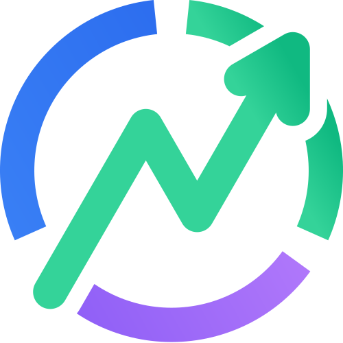

#  Pilot Finance


**Pilot Finance** est un cockpit financier personnel conçu pour l'auto-hébergement. Une application simple et sécurisée pour suivre votre patrimoine net, vos rendements et vos opérations récurrentes en toute confidentialité.

---

## ✨ Fonctionnalités

* 💰 **Suivi de patrimoine** : Visualisez l'évolution globale de vos actifs.
* 📈 **Simulation de rendements** : Gérez vos intérêts composés et projetez vos gains sur plusieurs années.
* 🔄 **Opérations récurrentes** : Automatisez le suivi de vos revenus et dépenses mensuelles.
* 🔐 **Sécurité renforcée** :
    * **Middleware de sécurité** : CSP stricte, headers de sécurité (HSTS, X-Frame-Options), nonces dynamiques.
    * **bcrypt** : Hashing sécurisé des mots de passe avec validation de complexité (5 critères).
    * **Rate Limiting avancé** : Protection multi-niveaux (login, register, 2FA, reset).
    * Chiffrement AES-256-GCM des données sensibles (mail, noms de comptes, transactions).
    * **Session Versioning** : Déconnexion automatique de tous les appareils en cas de changement de mot de passe.
    * Support natif des **Passkeys** (WebAuthn) et 2FA (TOTP).
    * **Health Check API** : Monitoring de l'état de la base de données et de la mémoire.
* 📧 **Gestion des Emails** (Optionnel) : Validation des comptes à l'inscription et récupération de mot de passe.
* 📱 **Interface Responsive** : Expérience fluide sur tous les supports (mobile, tablette et ordinateur).
* ⚡ **Performance optimale** : Backend Go ultra-léger (~15MB binaire), frontend HTMX + Alpine.js (~30KB JS).

---

## 🚀 Nouveautés v2.0.0

La version 2.0.0 est une **refonte technique complète** :

| Métrique | v1.x (Next.js) | v2.0 (Go) |
|----------|----------------|-----------|
| Image Docker | ~300 MB | ~20 MB |
| RAM utilisée | ~200 MB | ~30 MB |
| Temps démarrage | ~5s | <1s |
| JS Frontend | ~500 KB | ~30 KB |
| Vulnérabilités npm | Variables | **0** |

### Stack technique
- **Backend** : Go 1.25 + chi router
- **Frontend** : HTMX 2.0 + Alpine.js 3.15 + Tailwind CSS
- **Base de données** : SQLite (mode WAL)
- **Graphiques** : Chart.js 4.5

---

## 🗺️ Roadmap

**Version actuelle : 2.0.0** (Go, HTMX, Alpine.js, Passkeys, 2FA)

### Prochaines étapes

- [ ] 🌍 **Support multi-langues**
- [ ] 📊 **Export PDF des rapports**
- [ ] 🔔 **Notifications push**

---

## 🚀 Installation avec Docker

La méthode recommandée est d'utiliser **Docker Compose**.

### 1. Prérequis
* Un nom de domaine (indispensable pour les Passkeys et la validation SSL).
* Un reverse-proxy déjà configuré (Traefik, Nginx Proxy Manager, Cloudflare Tunnel, etc.).

### 2. Configuration (`docker-compose.yml`)

Créez un fichier `docker-compose.yml` dans votre dossier de travail :

```yaml
services:
  pilot:
    image: ghcr.io/neotoxicfr/pilot-finance:latest
    container_name: pilot
    restart: unless-stopped
    security_opt:
      - no-new-privileges=true
    cap_drop:
      - ALL
    environment:
      - TZ=Europe/Paris
      - HOST=pilot.votre-domaine.tld # Votre domaine sans https (ex: pilot.exemple.com)
      - ALLOW_REGISTER=true          # Mettre à false après votre inscription initiale
      - SMTP_HOST=                   # Optionnel : activer les emails
      - SMTP_PORT=587
      - SMTP_USER=
      - SMTP_PASS=
      - SMTP_FROM=
      - DATABASE_URL=file:/data/pilot.db
      - ENCRYPTION_KEY=              # Obligatoire : openssl rand -hex 32
      - BLIND_INDEX_KEY=             # Obligatoire : openssl rand -hex 32
      - AUTH_SECRET=                 # Obligatoire : openssl rand -hex 32
    volumes:
      - ./data:/data
    healthcheck:
      test: ["CMD", "wget", "--no-verbose", "--tries=1", "--spider", "http://127.0.0.1:3000/api/health"]
      interval: 30s
      timeout: 5s
      retries: 3
      start_period: 10s
```
### 3. Démarrage

Lancez le conteneur avec la commande suivante :
```bash
docker compose up -d
```
L'application écoute sur le port **3000** à l'intérieur du conteneur.

---

## 🛠️ Variables d'environnement

| Variable | Description |
| :--- | :--- |
| **HOST** | Votre nom de domaine complet sans le protocole (ex: `pilot.exemple.com`). Indispensable pour les Passkeys et les liens de mail. |
| **ENCRYPTION_KEY** | **Critique**. Clé de 32 octets (hex) pour le chiffrement AES des données. Si perdue, les données chiffrées sont irrécupérables. |
| **BLIND_INDEX_KEY** | **Critique**. Clé de 32 octets (hex) pour les index de recherche sécurisés (emails). |
| **AUTH_SECRET** | **Critique**. Clé de 32 octets min pour la signature des cookies de session JWT. |
| **ALLOW_REGISTER** | Permet ou bloque la création de nouveaux comptes. Il est conseillé de la passer à `false` après votre inscription. |
| **DATABASE_URL** | Chemin vers votre base de données SQLite (ex: `file:/data/pilot.db`). |
| **TZ** | Fuseau horaire du conteneur (ex: `Europe/Paris`) pour la précision des dates d'opérations. |

---

## 🛡️ Sécurité et Confidentialité

Pilot Finance a été construit avec la sécurité par défaut :

* **Zéro stockage en clair** : Les noms de comptes et libellés de transactions sont chiffrés. Seul votre serveur avec sa clé unique peut les lire.
* **Vérification au démarrage** : Le système refuse de démarrer si les clés de chiffrement sont manquantes ou trop faibles.
* **Protection Passkeys** : L'utilisation des Passkeys offre une protection robuste contre le phishing et élimine le besoin de mémoriser des mots de passe complexes.
* **Validation mot de passe** : 5 critères obligatoires (longueur, majuscule, minuscule, chiffre, caractère spécial).

---

## 🤖 Crédits & Conception

Ce projet a été conçu avec l'assistance d'une Intelligence Artificielle pour la structure et l'optimisation du code. Toutefois, **le code final est purement applicatif** et n'utilise aucun algorithme d'IA ou service tiers de traitement de données lors de son exécution. Votre cockpit reste 100% local et privé.

---

## 📝 Licence

Ce projet est distribué sous licence **MIT**.
